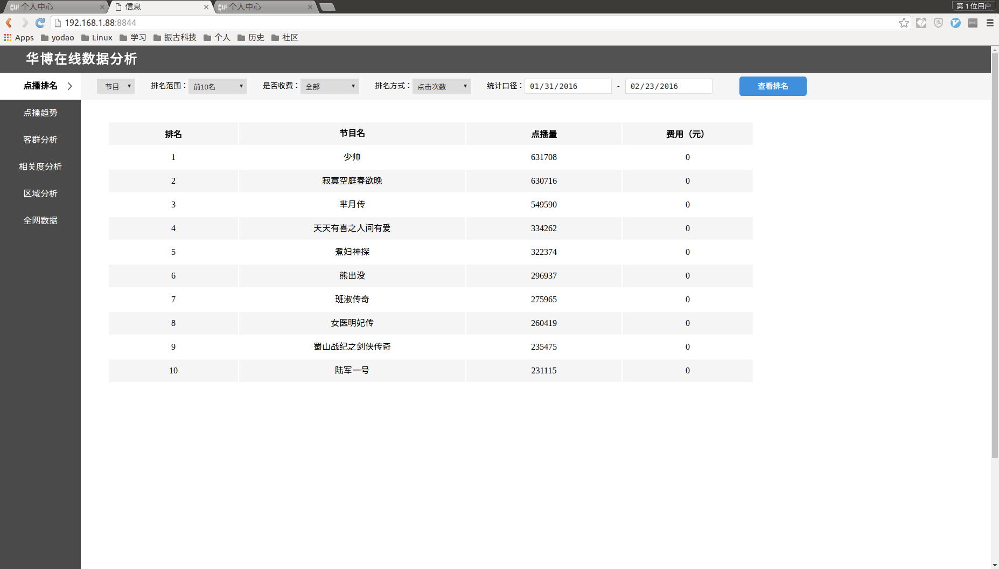
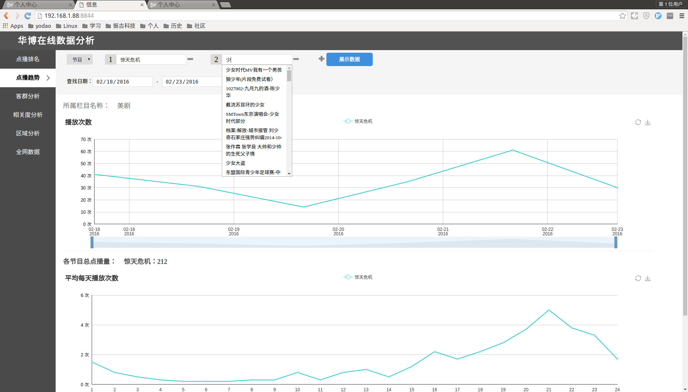
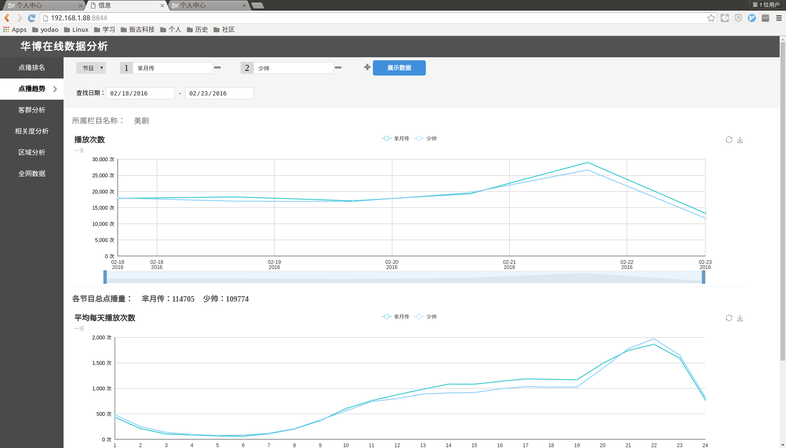
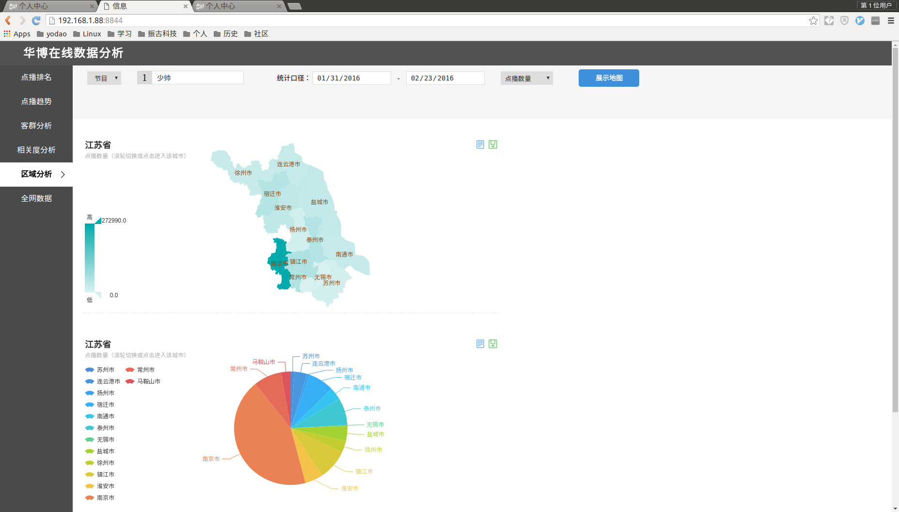

**Author**: *Xiang Wang* @   2016-05-31 10:54:07  
**e-mail**: [*ramwin@qq.com*](mailto:ramwin@qq.com)  

# 点播数据分析简介
**点播趋势分析**是我在 *南京振古信息科技有限公司* 全程参与的一个外包项目。  

* 项目名称: 点播数据分析
* 项目描述: 把客户提供的用户点播数据进行筛选，可视化展现
* 职责范围: 原始数据的筛选，处理，存储，数据库设计与优化，flask后台实现以及编写部分js代码  
* 相关技术: `flask`, `python`, `echarts`, `redis`, `sqlite`等

  
利用`redis`缓存部分数据，加速数据库查询。尤其是这种日排名，周排名的数据，查询一次后即可不再消耗关系型数据库的资源  

提供前端调用的接口，根据前端的需求编写`SQL`语句返回数据
