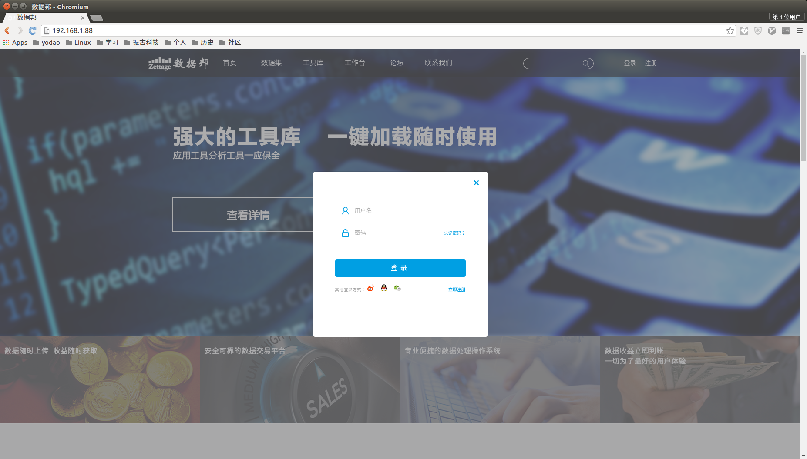
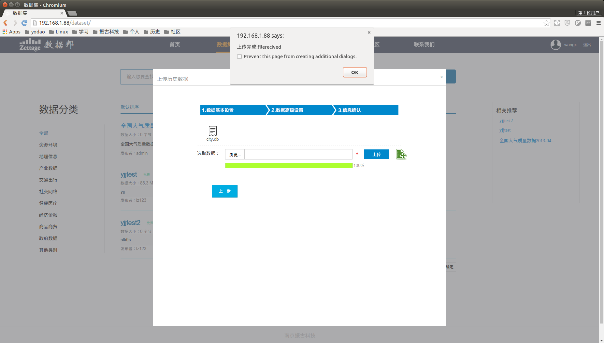
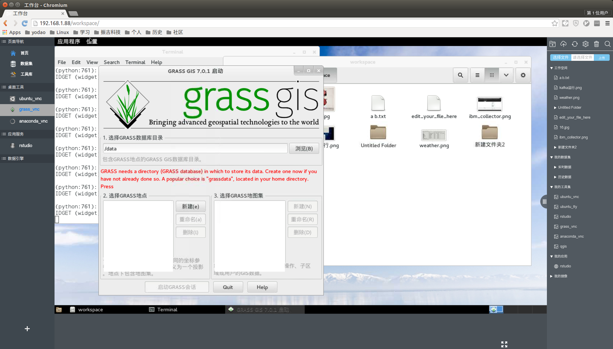
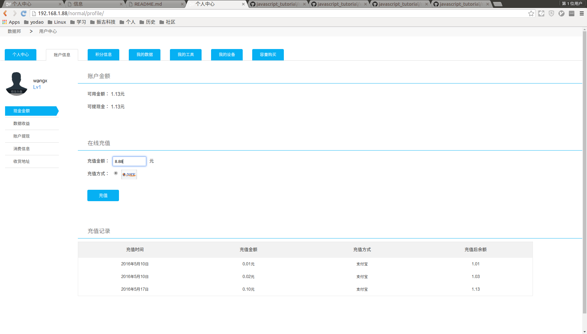
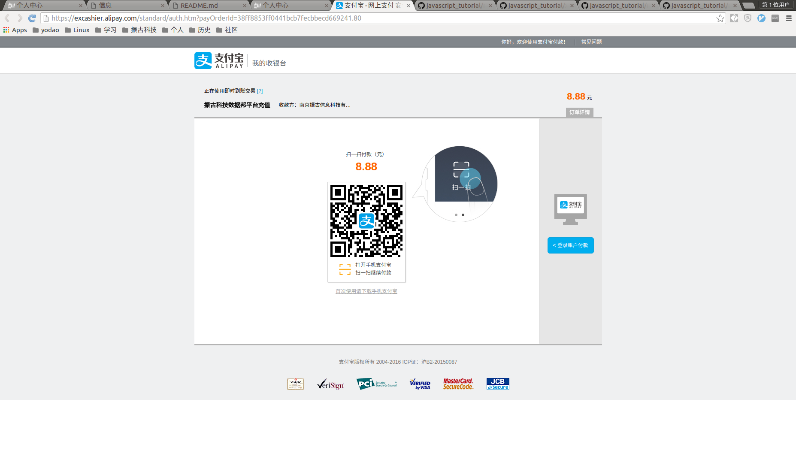
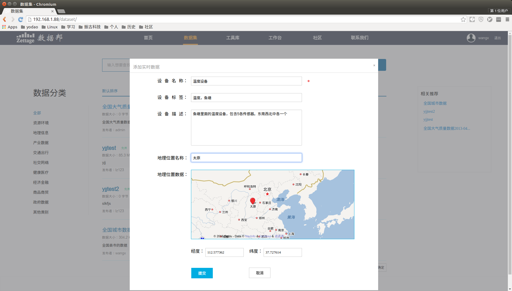
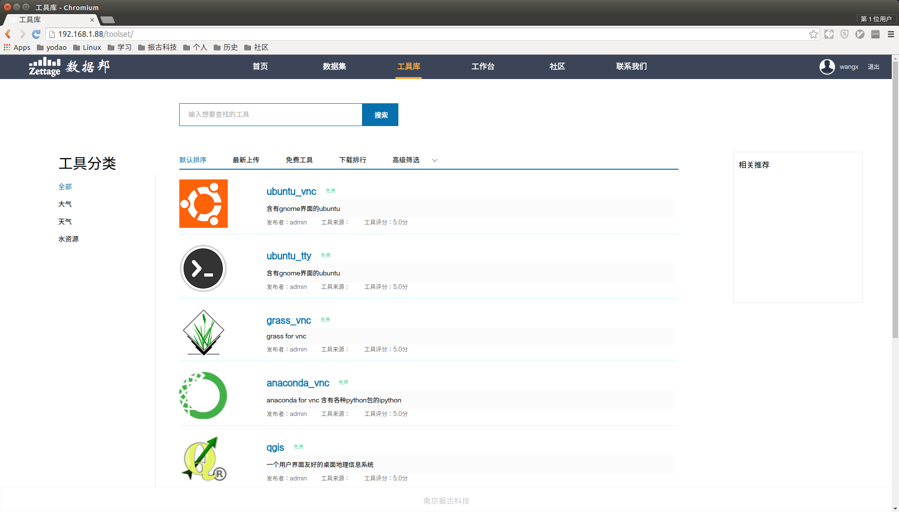

**Author**: *Xiang Wang* @   2016-05-30 15:47:42  
**e-mail**: [*ramwin@qq.com*](mailto:ramwin@qq.com)  

# 数据邦项目简介

**数据邦**是我在 *南京振古信息科技有限公司* 全程参与的一个产品项目。  
在这个项目里面我主要负责web后端，数据库设计使用，页面渲染部分。同时写部分前端js代码。

### 用户注册登录模块
  
利用所学的密码学知识，实现了一个网页的RSA基础加密功能。  
[javascript加密代码](https://github.com/ramwin/javascript_tutorial/blob/master/ramwin1_convert.js)  
[python解密代码](https://github.com/ramwin/javascript_tutorial/blob/master/xor_crypto.py)

### 大数据上传模块  
  
根据我的基础代码，其他人实现了数据邦的网页大文件上传功能，实现上传文件的同时对每块代码进行md5校验以及断点续传功能  
[javascript上传文件片段的基础代码](https://github.com/ramwin/django_tutorial/blob/master/chunk_upload/templates/chunk_upload/index.html)  
[django处理](https://github.com/ramwin/django_tutorial/blob/master/chunk_upload/views.py)  

### 工作台
  
后台由我的同事使用docker来创建各种应用，并提供 restful api。我根据前端传递的参数来调用后台接口。  
但是我也能够使用docker的基础命令，创建保存镜像，实现各个应用之间的环境隔离。  
[我使用过的docker镜像](https://hub.docker.com/u/ramwin/starred/)  

### 充值交易模块
  

调用支付宝提供的API接口，实现付款功能。处理支付宝发送的付款结果。

### 传感器模块
  
利用 redis, kafka, flask 实现大数据的增删改查功能。让用户能够自定义传感器，

### 工具模块

调用同事提供的 restful api 接口，实现工具上传，发布服务等功能。